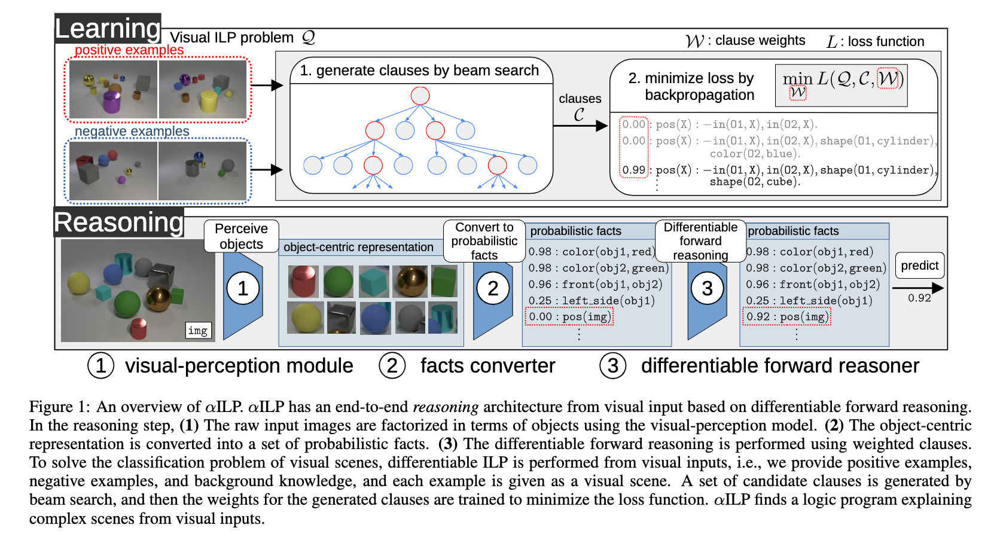

# alpha-ILP: Differentiable Learning of Logical Representations from Visual Scenes
This is the implementation of alpha-ILP. (Work in progress)



## Installation
The packages are specified in [requirements.txt](./requirements.txt). Please install the packages by:
```
pip install -r requirements.txt
```

## Training
### Kandinsky Patterns Twopairs Dataset:
```
python src/train.py --dataset-type kandinsky --dataset twopairs --batch-size 24 --no-cuda --n-beam 5 --t-beam 5
```
### CLEVR-Hans3 Dataset:
```
python src/train.py --dataset-type clevr --dataset clevr-hans0 --batch-size 1 --no-cuda --n-beam 15 --t-beam 5
python src/train.py --dataset-type clevr --dataset clevr-hans1 --batch-size 1 --no-cuda --n-beam 15 --t-beam 6
python src/train.py --dataset-type clevr --dataset clevr-hans2 --batch-size 1 --no-cuda --n-beam 15 --t-beam 7
```


# LICENSE
See [LICENSE](./LICENSE). The [src/yolov5](./src/yolov5) folder is following [GPL3](./src/yolov5/LICENSE) license.
